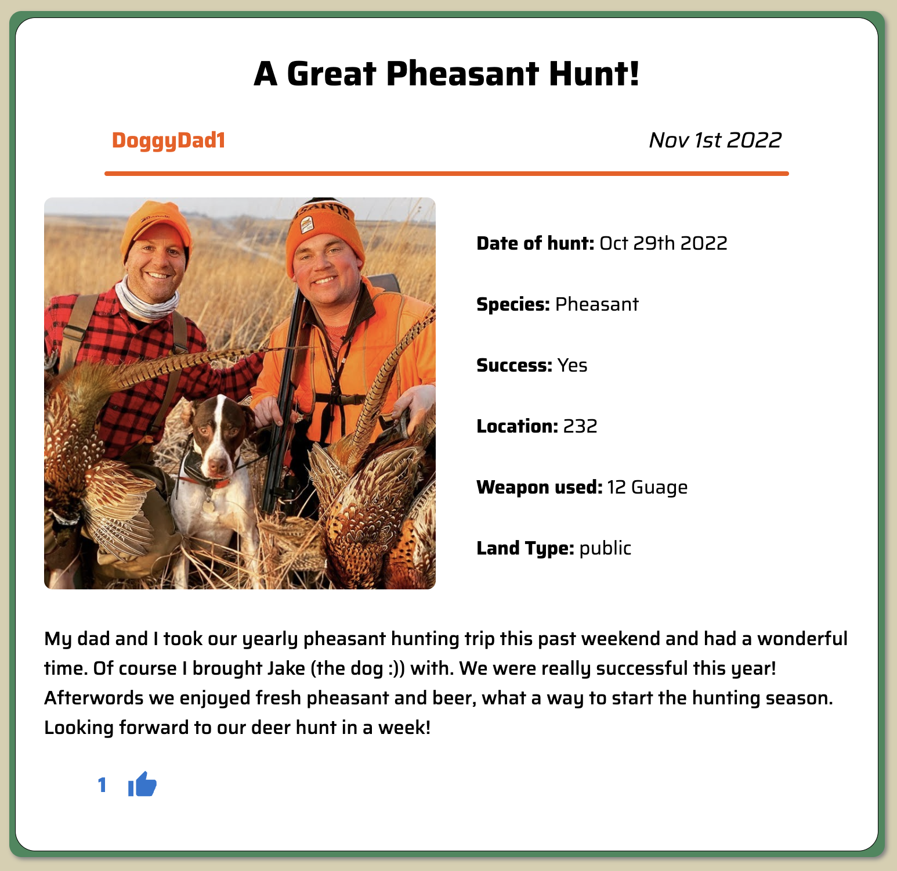

# Grip 'N Grin

## Description

Duration: 2 Week Sprint

This project, titled Grip 'N 'Grin is a social app for hunters. I wanted to make it as the only hunter to hunter information sites tend to be old blogs that havent been super active in a decade.
The user of Grip 'N Grin can upload hunts, view other hunts, and share info and comment to other users about the hunts. 

## Screen Shot

- Homepage screenshot

-Post Details of a single post:

- Comments area viewable below post details page:

### Prerequisites

Link to software that is required to install the app (e.g. node).

- [Node.js](https://nodejs.org/en/)
- [PostgreSQL](https://www.postgresql.org/)

## Installation

1. Create a database named `grip_n_grin`,
2. The queries in the `database.sql` file are set up to create all the necessary tables and populate the needed data to allow the application to run correctly. The project is built on [Postgres](https://www.postgresql.org/download/), so you will need to make sure to have that installed. We recommend using Postico to run those queries as that was used to create the queries, 
3. Open up your editor of choice and run an `npm install`
4. Run `npm run server` in your terminal
5. Run `npm run client` in your terminal
6. The `npm run client` command will open up a new browser tab for you!
7. Create a .env file with a 'SERVER_SESSION_SECRET=' value to run the password software

## Usage
How does someone use this application? Tell a user story here.

1. Register a username and password
2. Login if already registered
3. View home screen with list of hunts from other users
4. Click on any posts you would like to view more details about
5. Intereact with the user through likes and comments
6. If you would like to post a hunt of your own use the 'post hunt' button in the nav bar of the 'Post A Hunt' button on the home screen.
7. Enjoy!

## Built With

Technologies used:
- Material UI
- Axios
- date-fns
- dotenv
- express
- form-data
- moment.js
- multer
- passport
- react
- react-easy-crop
- react-router-dom
- react-dom
- redux-lobber/redux-saga/redux/react-redux
- sweetalert2

## Lessons learned

- Be diligent about code comments throughout the coding process.
- Control folder structure more logically.
- Be careful with state management to ensure state doesnt run into a mismatch with the dom or other elements.
    1) Example of this is the post details page, selectedPost was not correctly updating while using the 'LikeButton' component.
    Solved this problem in likes.saga through conditional FETCH_SELECTED_POST call.
    2) In edit should handle change directly to redux store instead of local state (useState)

### Future Development Goals

- Do some more in depth refactoring after some time has passed to clean up component layers and folder structure with a new view.
- Fix state mismatches mentioned above
- Integrate mapping system with species specific map overlays and selectors
- Create system for multiple concurrent users that reflects changes in real time - Socket.io
- Integrate search and filter features

## Acknowledgement
Thanks to [Prime Digital Academy](www.primeacademy.io) who equipped and helped me to make this application a reality. Thank you to Edan Schwartz, my fearless instructor and advisor. My cohort mates who helped support me through this entire process. And finally, my wife Julia who has taken on a lot of extra responsibilities while I focused on this project.

## Support
If you have suggestions or issues, please email me at [samuel.v.phipps@gmail.com](www.google.com)